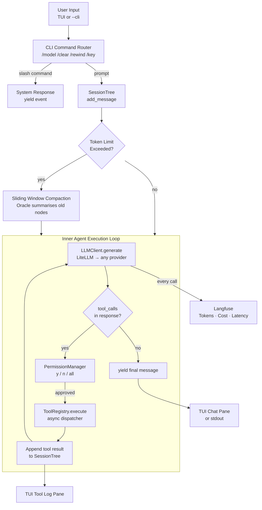
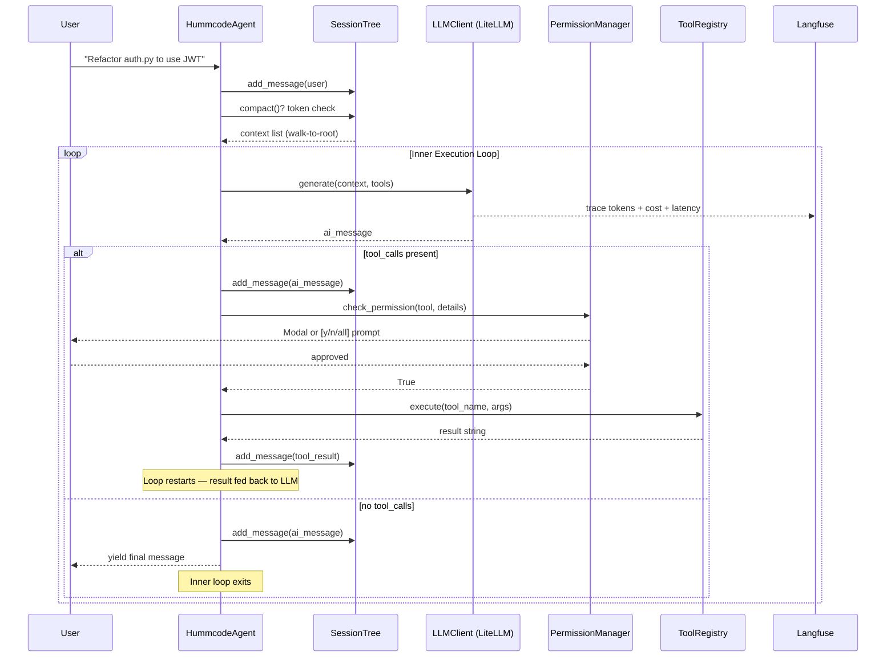
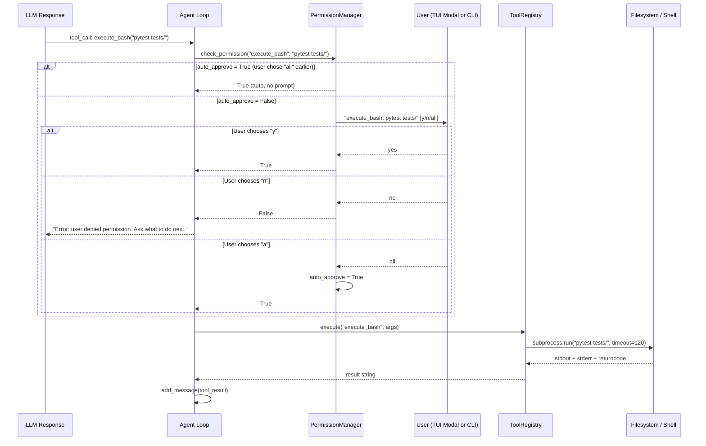
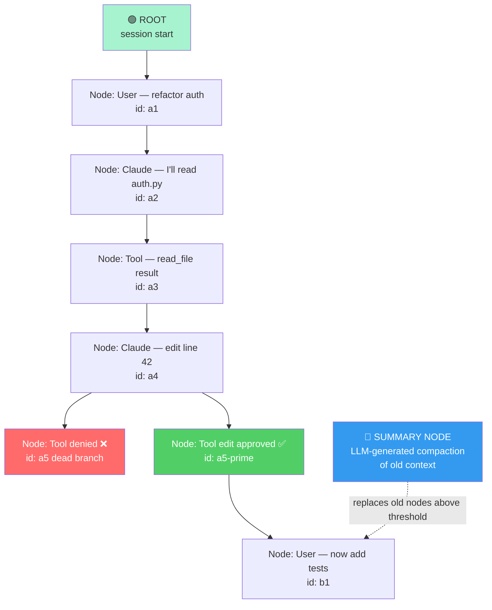

# 🐦 hummcode

**The Hummingbird Coding Agent — minimalist, powerful, model-agnostic, and composable.**

[](https://pypi.org/project/hummcode/)
[](https://www.python.org/)
[](LICENSE)
[](https://langfuse.com)

`hummcode` is an open-source AI coding agent built from first principles. No framework magic. No black boxes. Just a clean, composable core — a fast, precise tool you can fully read, understand, and extend.

Inspired by the hummingbird: tiny, aerodynamic, capable of hovering with perfect surgical precision, yet powerful enough to outperform much larger systems.

---

## Table of Contents

- [Why hummcode?](#why-hummcode)
- [How It Works](#how-it-works)
- [Technical Architecture](#technical-architecture)
  - [System Overview](#system-overview)
  - [Agent Execution Loop](#agent-execution-loop)
  - [Tool Execution & Permission Flow](#tool-execution--permission-flow)
  - [Memory Tree & Compaction](#memory-tree--compaction)
  - [Subsystem Breakdown](#subsystem-breakdown)
  - [Key Design Decisions](#key-design-decisions)
- [Features](#features)
- [Installation](#installation)
- [Quick Start](#quick-start)
- [Configuration](#configuration)
- [Running hummcode](#running-hummcode)
- [CLI Commands](#cli-commands)
- [Tools Reference](#tools-reference)
- [Memory System](#memory-system)
- [Observability](#observability)
- [UI Themes](#ui-themes)
- [Project Structure](#project-structure)
- [Roadmap](#roadmap)
- [Acknowledgements](#acknowledgements)

---

## Why hummcode?

Most coding agents are black boxes sitting on top of heavyweight frameworks. You can't see inside them, can't trust what they do with your files, and can't change how they think.

`hummcode` was built differently — studying reference implementations like [Geoffry Huntley's Go coding agent](https://ghuntley.com/agent/), the [Pi coding agent](https://github.com/earendil-works/pi), and [TeenyCode](https://github.com/yangshun/teenycode) — then synthesising the best ideas into a clean, pip-installable Python agent.

Every line has a reason. Every decision has an alternative it beat.

| Principle | What it means |
|---|---|
| **Minimal at core** | A `while True` loop + a small set of composable primitive tools. No 400-line framework initialisation. |
| **Model agnostic** | LiteLLM under the hood. Swap Claude, GPT-4o, Mistral, or Ollama by changing one env variable. |
| **Context is king** | Tree-based memory with sliding-window + LLM summarisation. The agent never crashes on token limits. |
| **Observable by default** | Every token, tool call, and cost traced to Langfuse from day one — not bolted on later. |
| **Permission-first** | Dangerous operations (file edits, bash) require explicit approval. No silent mutations. |
| **Language agnostic** | The agent reads and edits plain text files. It works on Python, Go, Rust, TypeScript, or any language. |

---

## How It Works

Traditional coding agents run a single LLM call and hope for the best. `hummcode` runs a structured agent loop:

```
   Simple Chatbot                     hummcode Agent
┌──────────────────┐           ┌────────────────────────────┐
│ User → LLM       │           │ User → CLI Router          │
│ → text response  │           │   → SessionTree (memory)   │
│ (no tools)       │           │   → Context Compaction     │
│ (no memory)      │           │   → Inner Execution Loop:  │
│ (no permissions) │           │     LLM → tool_calls?      │
│                  │           │     Yes → Permission Gate  │
└──────────────────┘           │       → ToolRegistry       │
                               │       → Result → Loop      │
                               │     No  → Final answer     │
                               │   → TUI (chat + tool pane) │
                               └────────────────────────────┘
```

|                    | Simple Chatbot              | hummcode                                              |
|--------------------|-----------------------------|-------------------------------------------------------|
| **Memory**         | Flat list, crashes at limit | Tree-based with rewind + compaction                   |
| **Tools**          | None                        | read, list, edit (surgical), bash, oracle             |
| **Permissions**    | Silent — does whatever      | Gated — y/n/all before any file or shell action       |
| **Model**          | Hardcoded                   | Agnostic — swap mid-session with `/model`             |
| **Observability**  | `print()` statements        | Full Langfuse trace — tokens, cost, latency           |
| **UI**             | Terminal print              | Dual-pane Textual TUI + headless CLI mode             |
| **Multi-model**    | No                          | Oracle pattern — delegate sub-tasks to cheaper model  |

---

## Technical Architecture

`hummcode` is built around a core insight: **a coding agent is a loop, not a chain**. The LLM doesn't finish when it generates text — it finishes when it has no more tools to call. Every architectural decision flows from managing that loop safely, cheaply, and transparently.

### System Overview



The system is divided into four logical layers connected by unidirectional data flow. The **input layer** (top) handles both typed prompts and slash commands, routing each to the correct handler before any LLM token is spent. The **memory layer** manages the `SessionTree` and decides whether compaction is needed before inference. The **execution loop** (centre) is the agent's heartbeat — it runs until the LLM produces a response with no tool calls. The **output layer** routes events to the correct UI pane or stdout.

The critical observation is that the LLM is called *inside* the loop, not once per user turn. A single user prompt may trigger 5–6 LLM calls as the agent reads files, checks outputs, and refines its approach. The `ToolRegistry` and `PermissionManager` sit between each call and the filesystem, ensuring no action is taken without a valid tool schema and, for dangerous operations, explicit user consent.

---

### Agent Execution Loop



The sequence shows why the inner loop is essential. When the agent reads `auth.py`, it generates a tool call for `read_file`. The result is appended to the tree and the LLM is called again — now with the file contents in context. It then generates a tool call for `edit_file`. The permission gate pauses execution. Once approved, the edit is applied, the result is appended, and the LLM is called a third time to confirm the change looks correct. Only then does it produce a plain-text final response and exit the loop.

**Why this matters:** Without an inner loop, the agent could only call one tool per user turn. Real coding tasks require sequences: list files → read file → edit file → run tests → fix errors. The inner loop handles this naturally, and the `SessionTree` keeps the full chain of evidence in context for every subsequent LLM call.

---

### Tool Execution & Permission Flow



The permission flow shows three distinct paths. The **auto-approve fast path** (user already chose "all") has zero overhead — it never prompts again for the rest of the session. The **deny path** is critical: rather than crashing or silently skipping, the agent receives the denial as a tool result and adjusts its plan. The **approve path** feeds the result back into the loop.

**Why this matters:** Coding agents that execute bash without gates are dangerous. The `PermissionManager` is not an optional safety add-on — it's a first-class architectural component. Its stateful `auto_approve` flag eliminates consent fatigue once you've established trust for a session, without compromising safety for users who haven't.

---

### Memory Tree & Compaction



The memory tree shows three key properties. First, every message is a `Node` with a `parent_id` — not a position in an array. Second, the dead branch (denied tool call) still exists in `self.nodes` but is unreachable from the active leaf, so it is never included in `get_llm_context()`. Third, when token count crosses the threshold, `compact()` summarises all nodes outside the sliding window into a single blue **Summary Node**, which becomes the new root. The sliding window nodes are relinked to point to this summary as their new parent.

**Why a tree over a flat list:**

| Aspect | Flat List (`messages = []`) | SessionTree (hummcode) |
|---|---|---|
| **Failed attempts** | Permanently in context — confuses the LLM | Excluded if on a dead branch |
| **Rewinding** | Impossible without manual splicing | `memory.rewind(node_id)` — one line |
| **Token overflow** | Crashes with 400 Bad Request | `compact()` summarises old nodes seamlessly |
| **Branching** | Cannot explore two approaches simultaneously | Natural — just move the leaf pointer |
| **Auditability** | Context is whatever was appended | Full tree preserved; every node inspectable |

---

### Subsystem Breakdown

#### 1. Core Event Loop (`core.py`)

`HummcodeAgent` is the orchestrator. Its `async process_prompt()` method is a generator — it `yield`s typed events (`status`, `tool_result`, `message`, `system`) rather than printing them directly.

**Why generators, not print:** The TUI and CLI consume the same agent. The TUI routes `status` events to the right-hand tool pane and `message` events to the left chat pane. The CLI prints everything to stdout. The agent brain knows nothing about how it's being displayed — it just yields typed events. Swapping the TUI for a web API requires zero changes to `core.py`.

---

#### 2. LLM Client (`llm.py`)

`LLMClient` wraps LiteLLM's `completion()` call into a single `generate(messages, tools, model)` method. The `default_model` is loaded from `DEFAULT_MODEL` env var at instantiation. It can be overridden mid-session via `/model`.

**Why LiteLLM:** LiteLLM provides a single unified API surface for 100+ providers. Switching from `anthropic/claude-sonnet-4-5-20250929` to `openai/gpt-4o` to `ollama/llama3` requires changing one string. The `llm.py` wrapper also creates a single choke point for future features: retry logic, fallback models, and cost budgeting can all be added here without touching `core.py`.

---

#### 3. Tool Registry (`tools/registry.py`) ⭐

`ToolRegistry` exposes two static methods: `get_tools()` returns the LiteLLM-compatible JSON schema array; `async execute()` parses arguments, applies permission gates, dispatches to the correct Python function, and returns a result string.

**Why a registry, not inline if/elif:** Without the registry, `core.py` contained 80+ lines of tool dispatch logic. With it, the inner loop collapses to three lines regardless of how many tools exist. Adding a new tool is: write the function, register the schema and route. The core loop never changes.

---

#### 4. Tool Primitives (`tools/file_ops.py`, `tools/shell.py`) ⭐

Four composable primitive tools — each does exactly one thing:

| Tool | What it does | Why it's designed this way |
|---|---|---|
| `read_file` | Read a file's full contents | No truncation — the LLM decides what's relevant. Truncating at 1,000 lines hides the bug on line 1,001. |
| `list_files` | Recursive listing, skipping noisy dirs | `node_modules` can contain 50,000 files. Skip them or lose the whole context window. |
| `edit_file` | Surgical search-and-replace | 500-line file, 5-line change = 5 tokens of diff. Full rewrite = 500 tokens + regression risk. Uniqueness validation prevents wrong-occurrence edits. |
| `execute_bash` | Any shell command, 120s timeout | Returns non-zero exit as a string so the LLM can self-correct, not crash. |

---

#### 5. Oracle Pattern (`tools/oracle.py`) ⭐

`ask_oracle` delegates isolated questions to a secondary model. The oracle receives only the question — not the full `SessionTree` history. Defaults to `ORACLE_MODEL` env var, falls back to the main model if not set.

**Why this matters:** The main agent's context window fills with tool results and conversation history. Delegating isolated lookups (summarise this document, look up this API) to a cheap secondary model keeps the main context lean. If you only have one API key, the oracle falls back gracefully — it never crashes.

---

#### 6. Permission Manager (`tools/permissions.py`)

`PermissionManager` holds an `auto_approve` flag and an optional `ask_callback`. In CLI mode: `input()` blocks for a keystroke. In TUI mode: `HummcodeApp` injects an `ask_callback` that pops a Textual `ModalScreen` and `await`s a button click without freezing the UI.

**Why a callback pattern:** The agent brain doesn't know it's talking to a TUI. Replacing the TUI modal with a web API permission endpoint is a one-line change: set a different `ask_callback`. Zero changes to `core.py` or `registry.py`.

---

#### 7. Memory System (`memory.py`) ⭐

`SessionTree` manages a dict of `Node` objects and a `current_leaf_id` pointer. `get_llm_context()` walks `parent_id` from leaf to root and reverses — producing the correct linear history for LiteLLM regardless of how many branches or rewinds have occurred. See [Memory System](#memory-system) for full detail.

---

#### 8. Terminal UI (`ui/tui.py`)

`HummcodeApp` extends Textual's `App`. The `@work` decorator runs `on_input_submitted` as a background async worker — the UI stays responsive while the LLM thinks. Events from `process_prompt()` are routed: `message` and `system` to the chat pane; `status` and `tool_result` to the tool log pane.

**Why separate panes:** Tool noise (Thinking..., [🔧 list_files], Result:...) would overwhelm the chat conversation if mixed together. Routing them to the right pane keeps the left side a clean, readable conversation history.

---

### Key Design Decisions

| Decision | Alternative Considered | Reason |
|---|---|---|
| Tree-based session memory | Flat `messages = []` list | Dead branches excluded from context; rewind without list surgery; compaction without index gymnastics |
| Surgical search-and-replace edit | Full file rewrite | Tokens scale with change size, not file size; no risk of unchanged-line regression |
| `ToolRegistry` dispatcher | Inline `if/elif` in core loop | Core loop stays 3 lines regardless of tool count; tools are independently testable |
| LiteLLM abstraction | Direct Anthropic/OpenAI SDK | Single API surface for 100+ providers; model swap is a one-string change |
| `async` generator (`yield` events) | Direct `print()` calls | Brain is display-agnostic; same agent powers TUI, CLI, and future web API |
| Permission `ask_callback` injection | Direct `input()` calls in agent | TUI modal and CLI prompt are interchangeable; zero changes to agent or registry |
| Oracle fallback to main model | Crash if `ORACLE_MODEL` not set | Works out of the box with one key; cheap oracle model is an upgrade, not a requirement |
| Skip noisy dirs in `list_files` | List everything | `node_modules`/`.git` blow up context window before a single source file is read |

---

## Features

| Feature | TUI | `--cli` |
|---|---|---|
| Model-agnostic LLM (100+ providers via LiteLLM) | ✅ | ✅ |
| Tree-based memory with rewind | ✅ | ✅ |
| Sliding window + LLM compaction | ✅ | ✅ |
| `read_file`, `list_files` tools | ✅ | ✅ |
| Surgical `edit_file` (search-and-replace) | ✅ | ✅ |
| `execute_bash` with timeout | ✅ | ✅ |
| Oracle pattern (secondary model) | ✅ | ✅ |
| Permission gates (y/n/all) | ✅ Modal | ✅ stdin |
| Langfuse observability | ✅ | ✅ |
| Slash commands (`/model`, `/key`, `/rewind`…) | ✅ | ✅ |
| Dual-pane TUI (chat + tool log) | ✅ | — |
| Extensible CSS themes | ✅ | — |
| BYOK (keys never leave your machine) | ✅ | ✅ |

---

## Installation

**Requirements:** Python 3.10+

```bash
pip install hummcode
```

---

## Quick Start

**1. Create a `.env` file** in your working directory:

```env
# At least one LLM provider key is required
ANTHROPIC_API_KEY=sk-ant-...

# Optional: other providers (model switching, oracle)
OPENAI_API_KEY=sk-...

# Default model (LiteLLM format)
DEFAULT_MODEL=anthropic/claude-sonnet-4-5-20250929

# Optional: dedicated cheaper model for oracle + compaction
ORACLE_MODEL=anthropic/claude-haiku-4-5

# Optional: Langfuse observability
LANGFUSE_PUBLIC_KEY=pk-lf-...
LANGFUSE_SECRET_KEY=sk-lf-...
LANGFUSE_BASE_URL=https://cloud.langfuse.com
```

**2. Launch:**

```bash
# Rich TUI (default)
hummcode

# Headless CLI
hummcode --cli
```

**3. Try your first tasks:**

```
You: List the files in this project, then read the pyproject.toml
You: Create a new file called hello.py that prints "Hello from hummcode!"
You: Run it with bash and show me the output
You: /model openai/gpt-4o
You: Now rewrite hello.py in TypeScript
```

---

## Configuration

| Variable | Required | Description | Default |
|---|---|---|---|
| `ANTHROPIC_API_KEY` | Yes* | Anthropic API key | — |
| `OPENAI_API_KEY` | No | OpenAI API key | — |
| `DEFAULT_MODEL` | No | Primary model string (LiteLLM format) | `anthropic/claude-sonnet-4-5-20250929` |
| `ORACLE_MODEL` | No | Model for oracle calls and compaction | Falls back to `DEFAULT_MODEL` |
| `LANGFUSE_PUBLIC_KEY` | No | Langfuse public key | — |
| `LANGFUSE_SECRET_KEY` | No | Langfuse secret key | — |
| `LANGFUSE_BASE_URL` | No | Langfuse host | `https://cloud.langfuse.com` |

> *At least one provider key required. Works with Anthropic, OpenAI, Mistral, Ollama, and any other LiteLLM-supported provider.

**Supported model string examples:**

```
anthropic/claude-sonnet-4-5-20250929
anthropic/claude-haiku-4-5
openai/gpt-4o
openai/gpt-4o-mini
ollama/llama3
mistral/mistral-large-latest
```

> ⚠️ **Security note:** `litellm` versions `1.82.7` and `1.82.8` contained a supply chain backdoor (March 2026). `hummcode` pins `>=1.83.0` in `pyproject.toml`. Always install from PyPI — never from an unofficial mirror.

---

## Running hummcode

### TUI Mode (default)

```bash
hummcode
```

```
┌─ Hummcode ───────────────────── Active: claude-sonnet-4-5 ─────────────────────────┐
│                                                                                      │
│  Chat                                         │  Tool Log                            │
│  ─────────────────────────────────────────    │  ──────────────────────────────────  │
│  🐦 Welcome to Hummcode!                      │                                      │
│  The Hummingbird Coding Agent built           │  Thinking...                         │
│  from first principles.                       │                                      │
│                                               │  [🔧] list_files('.')                │
│  You: list files and read pyproject.toml      │  Result: .env .gitignore src/...     │
│                                               │                                      │
│  Hummcode: Here are your project files.       │  [🔧] read_file('pyproject.toml')    │
│  Your pyproject.toml configures...            │  Result: [project] name=hummco...    │
│                                               │                                      │
└──────────────────────────────────────────────────────────────────────────────────────┘
  Type a message, or type / for commands...
  Commands: /info | /list | /model | /key | /clear | /rewind
```

### Headless CLI Mode

```bash
hummcode --cli
```

Standard terminal I/O — useful for SSH sessions, scripting, or piping output.

---

## CLI Commands

Type any command directly into the input bar. Tab-autocomplete works after typing `/`.

| Command | What it does | Why it exists |
|---|---|---|
| `/info` | Show hummcode version and tagline | Sanity check — confirm which version is running |
| `/list` | List all slash commands | Discoverability — no hidden commands |
| `/model <provider/name>` | Switch LLM mid-session | Test a cheaper model on a simple task; upgrade for a complex one |
| `/key <NAME> <value>` | Save an API key to `.env` live | Add a new provider without restarting |
| `/clear` | Reset `SessionTree`, start fresh | Clear context when switching to an unrelated task |
| `/rewind` | Undo last turn — move tree pointer back | Abandon a bad approach without the failed attempt poisoning the context |
| `exit`, `quit`, `:q` | Exit hummcode | Standard exit conventions |

---

## Tools Reference

`hummcode` exposes a small, composable set of primitive tools. The LLM decides which to call and when.

### `read_file`

Read the full contents of a file by relative path.

```
Args:    path (str)
Returns: file contents as string, or descriptive error
```

**Why no truncation:** The LLM is better at deciding what's relevant in a file than a truncation heuristic. Truncating at 1,000 lines silently hides the bug on line 1,001.

---

### `list_files`

Recursive directory listing. Automatically skips `.git`, `.venv`, `__pycache__`, `node_modules`, `build`, `dist`.

```
Args:    path (str, optional) — defaults to "."
Returns: sorted newline-separated list of relative paths
```

**Why skip those directories:** A `node_modules` folder can contain 50,000 files. Including it consumes the entire context window before the agent reads a single source file.

---

### `edit_file` ⭐

Surgical search-and-replace. The LLM provides the exact `old_str` to replace with `new_str`. Validates uniqueness before writing — refuses if the string appears 0 or 2+ times.

```
Args:       path (str), old_str (str), new_str (str)
Returns:    success message, or descriptive error
Permission: required — prompts before any write
```

Passing an empty `old_str` creates a new file or appends to an existing one.

**Why surgical over full rewrite:** A full-file rewrite for a 500-line file costs 500 lines of tokens. A surgical edit for changing one function signature costs 5 lines. Uniqueness validation prevents the LLM from accidentally editing the wrong occurrence.

---

### `execute_bash` ⭐

Run any bash command. Returns combined `stdout` + `stderr`. Prefixes with `Command failed (exit code N)` on non-zero exit, so the LLM can self-correct. Hard timeout: 120 seconds.

```
Args:       command (str)
Returns:    combined output string
Permission: required — prompts before any execution
```

**Why 120 seconds:** Long enough for `pytest`, `cargo build`, or `npm install`. Short enough to prevent a hung process from blocking the session indefinitely.

---

### `ask_oracle`

Delegate an isolated question or sub-task to a secondary model. The oracle receives only the question — not the full conversation history.

```
Args:       question (str), model (str, optional)
Returns:    oracle's answer string
Permission: not required — only makes an API call
```

**Why this matters:** If the agent has accumulated 30,000 tokens of context, asking it to also summarise a README wastes expensive capacity. The oracle handles isolated lookups cheaply. Falls back to the main model if `ORACLE_MODEL` is not set — never crashes.

---

## Memory System

### The Problem with Flat Lists

Every coding agent tutorial starts with `messages = []`. It works for five turns. Then:

- The agent reads a large file → token count spikes
- The agent tries five different bug fixes → all five failed attempts stay visible to the LLM
- The token limit is hit → `400 Bad Request`

`hummcode` solves all three with the `SessionTree`.

### Tree-Based Memory

Every message becomes a `Node`:

```python
@dataclass
class Node:
    data: Dict[str, Any]      # The message: role, content, tool_calls, etc.
    parent_id: Optional[str]  # Links to the previous message
    id: str                   # UUID — unique identifier
```

`get_llm_context()` walks `parent_id` from the active leaf to the root and reverses the list — producing the correct linear history for LiteLLM regardless of branches or rewinds.

### Rewinding

```bash
/rewind
```

Moves `current_leaf_id` back to the node recorded before your last prompt. The failed branch still exists in `self.nodes` but is unreachable from the active path — the LLM never sees it again.

### Context Compaction

When accumulated tokens cross `max_tokens` (default: 40,000):

1. All nodes outside the **sliding window** (default: last 10 turns) are collected
2. Their content is sent to `ORACLE_MODEL` with a summarisation prompt
3. A new **Summary Node** is created from the oracle's summary
4. The oldest sliding-window node has its `parent_id` relinked to the Summary Node
5. All old nodes become unreachable — cleanly dropped from future context

The tree is surgically trimmed. The LLM sees compact summary of the past, full detail for the last 10 turns.

---

## Observability

`hummcode` integrates [Langfuse](https://langfuse.com) automatically when your keys are set. Because LiteLLM's `success_callback` is used, every `generate()` call is traced with zero extra code in the agent logic:

```python
litellm.success_callback = ["langfuse"]
```

Each trace includes: full prompt + response, token counts (input + output), cost in USD, tool call chains, and latency per call.

**No Langfuse account?** Omit the keys from `.env`. hummcode works identically — observability is additive, never required.

---

## UI Themes

All styling lives in `.tcss` (Textual CSS) files in `src/hummcode/ui/themes/`. Zero style lives in Python code — making themes fully portable and community-contributable.

**Default: "Executive Cyber" theme**

| Element | Colour |
|---|---|
| Background | Deep charcoal `#1e1e1e` |
| Header / status bar | Slate dark `#0f172a` |
| Chat accent (You) | Cyan `#38bdf8` |
| Agent responses | Emerald `#a7f3d0` |
| Tool log | Slate `#475569` |
| Permission warnings | Amber `#fbbf24` |

**To create a custom theme:**

```bash
cp src/hummcode/ui/themes/default.tcss src/hummcode/ui/themes/mytheme.tcss
# Edit colours in mytheme.tcss
# Update CSS_PATH in tui.py to point to mytheme.tcss
```

Community theme contributions are welcome — open a PR with your `.tcss` file.

---

## Project Structure

```
hummcode/
├── pyproject.toml               # Package config, deps, CLI entry point
├── PLAN.md                      # Living architecture document
├── AGENTS.md                    # Agent system prompt and behavioural rules
├── .env                         # Your API keys (gitignored)
├── .env.example                 # Template — copy to .env to start
├── .gitignore
└── src/
    └── hummcode/
        ├── __init__.py
        ├── core.py              # HummcodeAgent, async process_prompt(), main()
        ├── llm.py               # LLMClient — LiteLLM wrapper
        ├── memory.py            # Node, SessionTree, compact()
        ├── tools/
        │   ├── __init__.py
        │   ├── registry.py      # ToolRegistry: schemas + async dispatcher
        │   ├── file_ops.py      # read_file, list_files, edit_file
        │   ├── shell.py         # execute_bash
        │   ├── oracle.py        # ask_oracle (secondary model pattern)
        │   └── permissions.py   # PermissionManager (async + callback)
        └── ui/
            ├── __init__.py
            ├── tui.py           # HummcodeApp, PermissionModal
            └── themes/
                └── default.tcss # "Executive Cyber" dark theme
```

**Key dependencies:**

| Package | Version | Purpose |
|---|---|---|
| `litellm` | `>=1.83.0` | Model-agnostic LLM API (100+ providers) |
| `langfuse` | `<3.0.0` | Observability and tracing |
| `pydantic` | Latest | Tool input schema validation |
| `textual` | Latest | Terminal UI framework |
| `python-dotenv` | Latest | `.env` file loading |

---

## Development Setup

```bash
git clone https://github.com/0xchamin/hummcode.git
cd hummcode

python3 -m venv .venv
source .venv/bin/activate     # Windows: .venv\Scripts\activate

pip install -e .

cp .env.example .env          # fill in your keys

hummcode                      # TUI
hummcode --cli                # headless
```

---

## Roadmap

- [ ] `/save` / `/load` — Persist and restore session trees to JSON
- [ ] Command autocomplete dropdown — Slack-style popup when typing `/`
- [ ] Streaming LLM responses — Token-by-token streaming into the chat pane
- [ ] Token + cost display — Live counter in TUI header
- [ ] Settings modal — In-TUI model and key management
- [ ] Multi-agent swarms — Parallel sub-agents on independent tree branches
- [ ] `/branch` command — Explicit tree fork for A/B approach comparison
- [ ] Session persistence — Resume work across terminal restarts

---

## Acknowledgements

`hummcode` stands on the shoulders of brilliant reference implementations:

- [Geoffry Huntley](https://ghuntley.com/agent/) — foundational coding agent architecture in Go and the progressive enhancement approach (chat → read → edit → bash)
- [Yang Shun / TeenyCode](https://github.com/yangshun/teenycode) — the principle that a full coding agent can be under 200 lines
- [Amp's "How to Build an Agent"](https://ampcode.com/notes/how-to-build-an-agent) — composable primitive tool philosophy
- [Pi Coding Agent](https://github.com/earendil-works/pi) — tree-based session memory and "Context is King"
- [LiteLLM](https://github.com/BerriAI/litellm) — model-agnostic LLM abstraction
- [Textual](https://github.com/Textualize/textual) — the TUI framework that makes terminal apps feel like desktop apps

---

## License

MIT © [Chamin Hewage](https://github.com/0xchamin) / [BlackEagleLabs.ai](https://blackeaglelabs.ai)

---

<p align="center">Built with precision. Like a hummingbird. 🐦</p>